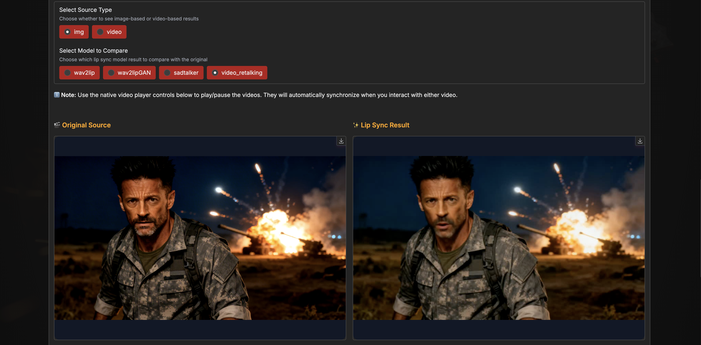

# The-Gargantuas-Video-Editor

**AI-Powered Video Editing Suite - 100% Free!**

A Python-based video editing application with AI upscaling and lip-sync capabilities.

## ✨ Features

- **🎨 AI Upscaling**: Enhance images and videos using RealESRGAN models
- **👄 AI Lip Sync**: Synchronize lips with audio using 4 advanced models (Wav2Lip, Wav2Lip GAN, SadTalker, Video-Retalking)
- **📝 AI Subtitles**: Generate accurate subtitles with Whisper + GPT/Groq/Gemini, multi-agent validation, and real-time editing
- **🌐 Multi-language**: Full internationalization support (English, Italian, more coming)
- **💯 100% Free**: No login, no subscriptions, no locked features (Groq & Gemini APIs are 100% free!)
- **🖥️ Multi-device Support**: CPU, GPU (CUDA), and MPS (Apple Silicon) acceleration
- **🌍 Cross-platform**: Compatible with macOS, Windows, and Linux
- **😊 Easy to Use**: Simple interface with powerful features
- **🔓 Open Source**: Free software you can trust

## 🚀 Try it on Google Colab (No PC Required!)

Don't have a powerful PC? No problem! Run the app directly on Google Colab with **FREE GPU T4** acceleration.

[](https://colab.research.google.com/drive/1dQScY7ALgOOIsfAdNCfZMxrfcSM5EPJK?usp=sharing)

> **📚 Complete Setup Guide**: 
> - **Quick Copy-Paste Script**: [colab_notebook_setup.py](colab_notebook_setup.py) - Copy entire content to a Colab cell
> - **Detailed Guide**: [docs/COLAB_SETUP.md](docs/COLAB_SETUP.md) - Full documentation with troubleshooting
> - **Quick Fix**: [COLAB_FIX.md](COLAB_FIX.md) - If you're getting cryptography errors

### Quick Start Guide (3 Simple Steps):

#### Step 1: Run the Setup Cell
Click the **play button** on the notebook cell to start downloading the repository and installing dependencies with GPU T4 support.

**⚠️ IMPORTANT**: The setup automatically installs `cryptography` FIRST to avoid import errors. This takes ~5-10 minutes.


#### Step 2: Launch the App
After installation completes, you'll see two links. **Click the second link** (the one that does NOT start with `127.0.0.1`).


#### Step 3: Start Editing!
The Gradio interface will open in a new browser tab. You're ready to use all the features!


> **💡 Pro Tips**: 
> - Use **Groq API** (100k tokens/day FREE) instead of Gemini (20 req/day)
> - Enable **Single Pass** validation mode to save API quota
> - For best performance on Colab, use videos **shorter than 30 seconds** to avoid timeouts
> - Check [Colab Setup Guide](docs/COLAB_SETUP.md) if you get errors

---

## Setup

### Quick Setup (Recommended)

#### macOS/Linux:
```bash
chmod +x setup.sh
./setup.sh
```

#### Windows:
```cmd
setup.bat
```

The setup script will automatically:
- Check/install Python 3.11.0 (via pyenv)
- Create virtual environment (`.venv`)
- Install all dependencies

### Manual Installation

If you prefer to install manually:

1. **Install Python 3.11.0**:
```bash
pyenv install 3.11.0
pyenv local 3.11.0
```

2. **Create and activate virtual environment**:
```bash
python -m venv .venv
source .venv/bin/activate  # macOS/Linux
# OR
.venv\Scripts\activate.bat  # Windows
```

3. **Install dependencies**:
```bash
pip install --upgrade pip
pip install -r requirements.txt
```

## Running the Application

### Quick Start (Easiest Method)

For users who have already run the setup script, you can start the app with a single command:

#### macOS/Linux:
```bash
./run.sh
```

#### Windows:
```cmd
run.bat
```

These scripts automatically:
- Activate the virtual environment
- Start the application
- No need to remember Python commands!

### Manual Start

If you prefer to run manually:

1. **Activate virtual environment** (if not already active):
```bash
source .venv/bin/activate  # macOS/Linux
# OR
.venv\Scripts\activate.bat  # Windows
```

2. **Run the app**:
```bash
python main.py
```

The app will open in your browser at `http://localhost:7860`

## Usage

1. Launch the application:
   - **macOS/Linux**: `./run.sh`
   - **Windows**: `run.bat`
2. Choose your workflow:
   - **Upscaler** tab: Enhance images and videos with AI upscaling
   - **Lip Sync** tab: Synchronize lips with audio using 4 AI models
   - **Audio to Subtitles** tab: Generate accurate subtitles with Whisper + GPT/Groq/Gemini
   - **Settings** tab: Configure API keys for OpenAI, Groq, and Gemini (Groq & Gemini are FREE!)
3. Open the **🔍 Video Comparison Modal** to see examples of different models
4. Check out the **❤️ Support Me** tab if you find the app useful!

The app is completely free and works without any login or registration!

### Interface Overview

#### 1. Model Selection
Select your preferred upscaling model and the compute device (CPU, CUDA, or MPS) based on your hardware.


#### 2. Upload and Processing
Upload your image or video file, set the FPS for videos (0 keeps the original FPS - recommended), and click the **Upscale** button. The progress bar will show:
- Processing progress
- Average time per frame
- Estimated time remaining

The upscaled result will appear on the right once processing is complete.


#### 3. Video Comparison Modal
Compare all models side-by-side! This modal displays 4 pairs of videos:
- Left side: Original base video
- Right side: Upscaled result for each of the 4 models

Perfect for choosing the best model for your content!


## Supported Upscaling Models

| Model | Description | Base Video | Example Video |
|-------|-------------|------------|---------------|
| **RealESRGAN_x4plus** (default) | 4x scale, general purpose | [▶️ Base](example/example_video/base.mp4) | [▶️ Upscaled](example/example_video/example%20RealESRGAN_x4plus.mp4) |
| **RealESRGAN_x2plus** | 2x scale, lighter upscaling | [▶️ Base](example/example_video/base.mp4) | [▶️ Upscaled](example/example_video/example%20RealESRGAN_x2plus.mp4) |
| **RealESRNet_x4plus** | 4x scale, cleaner output | [▶️ Base](example/example_video/base.mp4) | [▶️ Upscaled](example/example_video/example%20RealESRNet_x4plus.mp4) |
| **RealESRGAN_x4plus_anime_6B** | 4x scale, optimized for anime/cartoon content | [▶️ Base](example/example_video/base.mp4) | [▶️ Upscaled](example/example_video/example%20RealESRGAN_x4plus_anime_6B.mp4) |

> 💡 **Tip**: Download the repository to view the example videos locally and compare the quality differences between models.

## Features in Detail

### AI Upscaling
- Automatic detection of image vs video files
- Audio preservation for videos (automatically extracted and re-added)
- Progress tracking with performance metrics (seconds/frame, ETA)
- Multiple AI models optimized for different content types

### Performance Monitoring
- Real-time progress updates in Gradio interface
- Terminal output with timing information per frame
- Final statistics: total time, average s/frame, processing speed

### Video Comparison Modal
- Side-by-side comparison of original vs upscaled videos
- Example videos for all models included
- Synchronized playback controls
- Loop functionality for continuous comparison
- Native aspect ratio preservation

## AI Lip Sync

The Lip Sync tab provides powerful AI-driven lip synchronization using multiple state-of-the-art models.

### Lip Sync Examples Gallery

The tab includes an interactive gallery to compare different AI lip-sync models:



**Features:**
- **Source Selection**: Switch between image and video sources
- **Model Comparison**: Compare results from Wav2Lip, Wav2Lip GAN, SadTalker, and Video-Retalking
- **Side-by-Side View**: See original source next to processed result
- **Synchronized Playback**: Videos automatically sync when playing/pausing/seeking
- **Easy Navigation**: Select different models to instantly see quality differences

### Supported Lip Sync Models

| Model | Description | Best For | Processing Speed |
|-------|-------------|----------|------------------|
| **Wav2Lip** | Base model - Fast and reliable | Quick previews and testing | ⚡⚡⚡⚡⚡ |
| **Wav2Lip GAN** | Enhanced version with better quality | Balanced quality/speed production | ⚡⚡⚡⚡ |
| **SadTalker** | Full facial animation with expressions | Static portrait animation | ⚡⚡ |
| **Video-Retalking** | Maximum quality with face enhancement | Professional productions | ⚡ |

> 💡 **Tip**: All lip sync models are downloaded automatically on first use. Try the examples gallery to compare quality before processing your own content!

## � AI Subtitles Generation

The Audio to Subtitles tab provides a complete AI-powered subtitle generation workflow with advanced validation.

### 5-Step Workflow

#### Step 1: Paste & Clean Lyrics
- Paste your song lyrics or reference text
- AI-powered cleaning removes timestamps, sections, and formatting
- Supports OpenAI, Groq, and **Gemini (100% FREE with 1M tokens/min!)**

#### Step 2: Upload Audio
- Upload your audio file (MP3, WAV, M4A, etc.)
- Supported formats: any audio format supported by FFmpeg

#### Step 3: Transcribe Audio
- Uses **Whisper** (faster-whisper) for word-level transcription
- Extracts **both**:
  - **Segments**: Standard subtitle grouping (phrases/sentences)
  - **Words**: Word-by-word timing (precise karaoke-style)
- Automatic language detection
- Full audio transcription (no 30s limit!)

#### Step 4: Generate Subtitles
- AI generation using GPT (OpenAI), Llama (Groq), or Gemini (Google)
- **3 Ultra-Detailed Modes**:
  - **Disabled**: Standard subtitles (natural grouping)
  - **Basic**: New subtitle on pauses (customizable threshold)
  - **Word-by-Word**: One word per subtitle (karaoke-style)
- **Multi-Agent Validation** (optional, enabled by default):
  - 🤖 **Agent 1**: Timing Validator (overlaps, gaps, durations)
  - 🤖 **Agent 2**: Lyrics Matcher (accuracy vs ground truth)
  - 🤖 **Agent 3**: Format Validator (SRT/VTT/ASS compliance)
  - 🤖 **Agent 4**: Text Corrector (applies fixes)
  - 🧠 **Coordinator**: Decides when to stop (max 10 iterations)
- **Real-time validation log**: See agent conversations and decisions
- **Song-aware**: Agents understand long gaps in songs are normal (instrumental sections)

#### Step 5: Preview & Edit
- **Audio player** with waveform visualization
- **Interactive subtitle editor**: Click subtitle to jump to timestamp
- **Real-time editing**: Modify text, timing, or delete subtitles
- **DataTable interface**: Edit timestamps and text directly

### Export Formats

- **SRT** (SubRip): Universal format, works everywhere
- **VTT** (WebVTT): Web standard, supports styling
- **ASS** (Advanced SubStation Alpha): Professional format with effects

### API Provider Options

| Provider | Cost | Models | Limits | Speed | Best For |
|----------|------|--------|--------|-------|----------|
| **Gemini** | **100% FREE** | Gemini 1.5 Pro/Flash, 2.0 Flash | **1M tokens/min** | ⚡⚡⚡⚡⚡ | **Everyone! Best free tier** |
| **Groq** | **100% FREE** | Llama 3.3 70B, Llama 3.1 8B | 100k tokens/day | ⚡⚡⚡⚡⚡ | Fast alternative |
| **OpenAI** | Paid ($) | GPT-4o, GPT-4o-mini | Pay per use | ⚡⚡⚡ | High accuracy needs |

> 💡 **Tip**: Start with **Gemini** (free + highest limits!) for the best experience. The multi-agent validation works with all providers!

### Advanced Settings

- **Max Characters per Line**: 20-60 (default: 42)
- **Max Lines per Subtitle**: 1-3 (default: 2)
- **Pause Threshold**: 0.5-3.0s (for basic ultra mode)
- **Multi-Agent Validation**: Toggle 4-agent validation system

### Example Use Cases

- **Music Videos**: Use word-by-word mode for karaoke-style subtitles
- **Podcasts**: Standard mode for natural speech grouping
- **Language Learning**: Multi-agent validation ensures perfect accuracy
- **Professional Projects**: Export to ASS format with custom styling

> 🎵 **Song Mode**: The system automatically detects songs and tells agents that long gaps (30-60s) are normal for instrumental breaks. No more incorrectly merged subtitles!

## �📚 Documentation

Comprehensive guides and documentation available in the [`docs/`](docs/) folder:

- **[Quick Start Guide](docs/QUICKSTART.md)** - Fast setup and first run
- **[LipSync Guide](docs/LIPSYNC.md)** - Complete guide for AI lip-sync feature
- **[I18N Guide](docs/I18N.md)** - Internationalization and translations
- **[OpenCV Patch](docs/OPENCV_PATCH.md)** - Compatibility fix details
- **[Project Structure](docs/PROJECT_STRUCTURE.md)** - Codebase organization
- **[Changelog](docs/CHANGELOG.md)** - Version history and updates

## 📦 AI Models

**All AI models are downloaded automatically on first use** - you don't need to download anything manually!

- RealESRGAN models (~60-100MB each) - Downloaded when using Upscaler
- LipSync models (150MB - 2GB) - Downloaded when using each model for the first time
- Models are cached in `models/` folder (not included in git due to size)

**First Run**: Expect longer processing time as models download. Subsequent runs will be much faster!

## Dependencies & Credits

This project is built with amazing open source technologies:

### Core Technologies
- **[Gradio](https://gradio.app/)** (Apache 2.0) - Web interface framework
- **[PyTorch](https://pytorch.org/)** (BSD-style) - Deep learning framework
- **[RealESRGAN](https://github.com/xinntao/Real-ESRGAN)** (BSD 3-Clause) - AI upscaling models
- **[BasicSR](https://github.com/XPixelGroup/BasicSR)** (Apache 2.0) - Super-resolution framework

### Additional Libraries
- **OpenCV** - Image/video processing
- **FFmpeg** - Video encoding/decoding
- **Pillow** - Image manipulation
- **NumPy** - Numerical computing

Special thanks to all contributors and maintainers of these projects!

## 📧 Contact

For issues, suggestions, or questions, feel free to contact me at:

**📬 thegargantuamusic@gmail.com**

## License

This project is licensed under the MIT License - see the [LICENSE](LICENSE) file for details.

